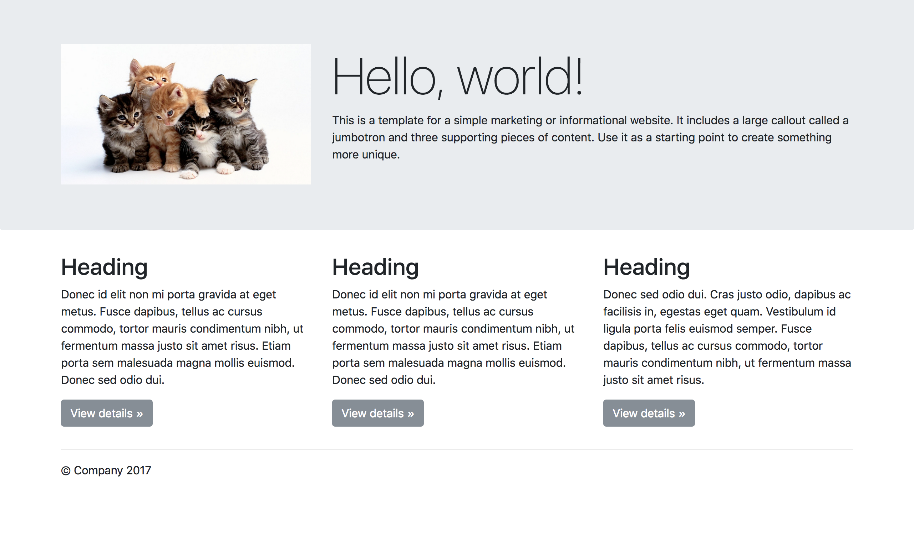

# HTML/CSS Refresher Challenge  

Create an HTML page with the following contents, you can use images and text from the web:

* Title content 
* Header content `<h1>`
* Paragraph content `<p>`
* Image tags ``
* External Links `<a href>`

Other requirements  

* Must be mobile responsive (bootstrap) 
* External CSS Styles file `.css`
* (optional) External Javascript file `.js`

## Design Suggestion  

You can follow this design and choose your own set of styles, colors, effects.



## Project Structure 

Don't forget to organize your files 

```
ProjectFolder
│   index.html
|   styles.css   
|   script.js (optional)
```


### References 
1. [Web Literacy Cheatsheet](https://github.com/youthradio/Youth-Radio-Web-Literacy/blob/master/Web-Literacy-Cheatsheet.md)
2. [CSS Basics](https://github.com/youthradio/Youth-Radio-Web-Literacy/blob/master/css-basics.md)
3. [Bootstrap Introduction](https://getbootstrap.com/docs/4.0/getting-started/introduction/)
4. [Boostrap Grid Layout](https://getbootstrap.com/docs/4.0/layout/grid/)
5. [Javascript/HTML/CSS ](https://github.com/youthradio/Youth-Radio-Web-Literacy/blob/master/javascript-html-and-css-basics.md)
